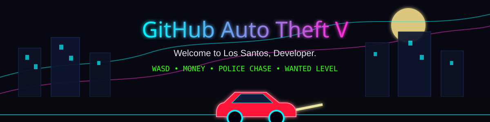

# Olá, eu sou o Vitor Daniel 👋

### Engenharia de Software • Back-end • Cibersegurança

 

 

---

## Sobre mim

Sou estudante de **Engenharia de Software**, com interesse principal em **Cibersegurança**, desenvolvimento **Back-end** e construção de **APIs REST**.

Desenvolvo projetos utilizando Python, Django e FastAPI, buscando aplicar boas práticas de programação, controle de acesso, validação de dados e segurança de aplicações.

Atualmente, concentro meus estudos em segurança web, OWASP Top 10, autenticação, Linux, Docker e desenvolvimento seguro de APIs.

---

## Tecnologias

 

<table>
  <tr>
    <td><b>Back-end</b></td>
    <td>Python, Django, Django REST Framework e FastAPI</td>
  </tr>
  <tr>
    <td><b>Banco de dados</b></td>
    <td>PostgreSQL, MySQL e SQLite</td>
  </tr>
  <tr>
    <td><b>Web</b></td>
    <td>HTML, CSS e JavaScript</td>
  </tr>
  <tr>
    <td><b>Ambiente</b></td>
    <td>Linux, Bash e Docker</td>
  </tr>
  <tr>
    <td><b>Ferramentas</b></td>
    <td>Git, GitHub e Visual Studio Code</td>
  </tr>
</table>

---

## Foco profissional

### 🔐 Cibersegurança

Estudo de fundamentos de segurança da informação e proteção de aplicações web, com atenção a vulnerabilidades, autenticação, autorização e controle de acesso.

### ⚙️ Desenvolvimento Back-end

Construção de aplicações e APIs REST utilizando Python, Django e FastAPI, integradas a bancos de dados relacionais.

### 🛡️ Segurança de APIs

Aplicação de validação de dados, gerenciamento de permissões, proteção de endpoints, variáveis de ambiente e tratamento adequado de erros.

---

## Conhecimentos em segurança

* Fundamentos de Segurança da Informação
* Segurança em aplicações web
* OWASP Top 10
* Autenticação e autorização
* Controle de acesso e permissões
* Segurança em APIs REST
* Validação e tratamento de dados
* Gerenciamento de variáveis de ambiente
* Princípios de desenvolvimento seguro
* Fundamentos de Linux e linha de comando

---

## Formação

🎓 **Bacharelado em Engenharia de Software**
Universidade de Vassouras — em andamento

🔧 **Técnico em Mecânica Industrial**
SENAI

📊 **Técnico em Administração**

---

## Atualmente estudando

* Segurança de aplicações web
* OWASP Top 10
* Testes de segurança em APIs
* Autenticação com JWT
* Django REST Framework
* FastAPI
* Linux e Bash
* Docker e Docker Compose
* Testes automatizados com Pytest

---

## Projetos em destaque

### 🛗 Projeto IoT — Elevador Inteligente

Sistema desenvolvido com Django para gerenciamento de entregas realizadas por um elevador automatizado.

O projeto possui painel web, controle de usuários, gerenciamento de entregas e endpoints para comunicação com o dispositivo IoT.

**Tecnologias:** Python, Django, SQLite, HTML, CSS, JavaScript e API REST.

  

### 🌳 Árvore Binária de Busca

Aplicação web desenvolvida para inserir, buscar, remover e organizar elementos em uma árvore binária de busca.

**Tecnologias:** Python, Flask, HTML, CSS e JavaScript.

---

## GitHub Auto Theft V

> Projeto visual inspirado em Los Santos, criado para transformar o gráfico de contribuições do GitHub em uma experiência interativa.

  

  <b>Welcome to Los Santos, Developer.</b>

---

## Estatísticas

---

## Contribuições

<picture>
  <source media="(prefers-color-scheme: dark)" srcset="https://raw.githubusercontent.com/VitorDanielRC/VitorDanielRC/output/github-contribution-grid-snake-dark.svg">
  <source media="(prefers-color-scheme: light)" srcset="https://raw.githubusercontent.com/VitorDanielRC/VitorDanielRC/output/github-contribution-grid-snake.svg">
  
</picture>

---

## Contato

---

<i>“No mapa do código, cada commit é uma rua nova.”</i>

  

Desenvolvido por **Vitor Daniel**

